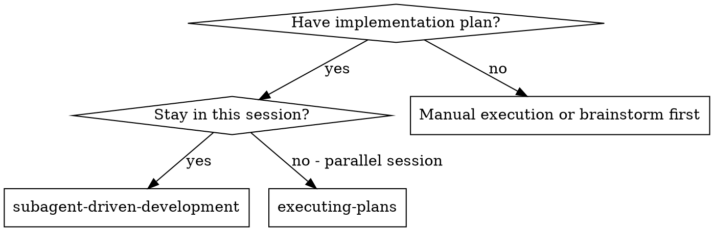
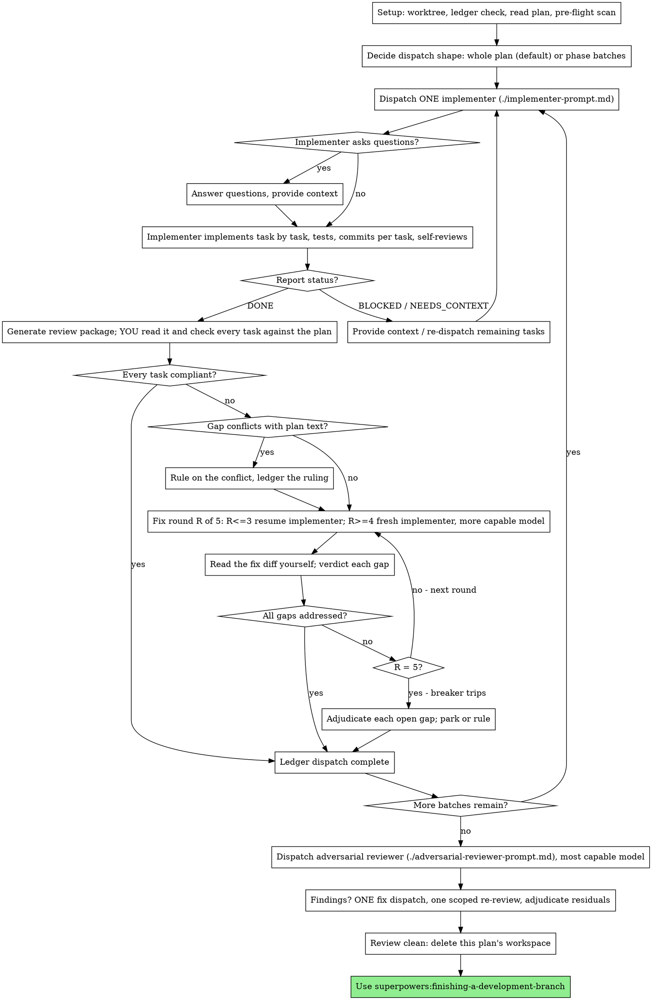

# Subagent-Driven Development

Execute the plan by dispatching ONE implementer subagent for the whole plan,
checking its work against the plan yourself, then dispatching a single
adversarial reviewer over the finished branch.

**Why subagents:** You delegate the plan to an agent with isolated context.
By precisely crafting its instructions and context, you ensure it stays
focused and succeeds. It should never inherit your session's context or
history — you construct exactly what it needs. This also preserves your own
context for coordination, plan compliance, and rulings.

**Core principle:** One implementer for the plan + your own plan-compliance
check + one adversarial whole-branch review = high quality, few dispatches

**Narration:** between tool calls, narrate at most one short line — the
ledger and the tool results carry the record.

**Continuous execution:** Do not pause to check in with your human partner
while the plan runs. The only reasons to stop are the four named below, or
the plan being complete. "Should I continue?" prompts and progress summaries
waste their time — they asked you to execute the plan, so execute it.

**Rulings, not stalls.** A running plan does not wait on a human. Conflicts,
ambiguities, plan defects, a cap you would have asked to exceed — decide
them. The spec is the binding authority, the plan is its argument, and your
judgment settles what neither answers. Record every decision in the ledger as
`Ruling: <what you decided> — <why> — <what it costs if wrong>`, and keep
going. A wrong ruling costs rework your human partner can see and undo; a
session parked on a question costs their whole day and buys nothing.

Four things stop you, and only these: an irreversible or destructive
operation; a security-sensitive action; a side effect outside this worktree
that norms say you ask about first (a merge, a push to a shared branch, a
publish); and a plan so broken that every path forward is a guess. For those,
stop and ask.

## When to Use



**vs. Executing Plans (parallel session):**
- Same session (no context switch)
- One fresh implementer carries the plan (no pollution from your context)
- You check plan compliance; one adversarial review at the end
- Faster iteration (no human-in-loop while the plan runs)

## The Process



## Setup

Ensure the work happens in an isolated workspace: use
superpowers:using-git-worktrees to create one or verify the existing one.
Never start implementation on a main/master branch without your human
partner's explicit consent.

Conversation memory does not survive compaction. In real sessions,
controllers that lost their place have re-dispatched entire completed task
sequences — the single most expensive failure observed. Track progress in
a ledger file, not only in todos.

- Each plan owns a workspace: at skill start, run this skill's
  `scripts/sdd-workspace PLAN_FILE` — it prints the plan's git-ignored
  directory (`<repo-root>/.superpowers/sdd/<plan-basename>/`), home to
  every artifact for THIS plan: ledger, briefs, reports, review packages.
  Another plan's directory is never yours to read or write.
- Check for this plan's ledger at `<workspace>/progress.md`. If its first
  line names your plan file, tasks covered by a `complete` line are DONE —
  do not re-dispatch them; resume at the first task without one. A dispatch
  whose last line is a fix round is mid-loop: resume the loop at the next
  round. A ledger whose first line names a different plan file — or a stray
  ledger at the old flat path `.superpowers/sdd/progress.md` — is another
  plan's progress: leave it in place and start your own, fresh.
- Create the ledger with its identity as the first line:
  `# SDD ledger — plan: <plan file path>`.
- The ledger is your recovery map: the commits it names exist in git even
  when your context no longer remembers creating them. After compaction,
  trust the ledger and `git log` over your own recollection.
- `git clean -fdx` will destroy the workspace (it's git-ignored scratch); if
  that happens, recover from `git log`.

Read the plan once, note its context and Global Constraints, and create a
todo per task. If the plan names a Spec, read that too: the spec is the
authority the plan argues from, and conflicts inside the plan resolve
against it. A plan with no reachable spec gets a ledger note saying so —
rulings made without one are provisional.

### Pre-flight scan

Before dispatching, scan the plan once for conflicts, writing down what you
checked as you check it:

- tasks that contradict each other or the plan's Global Constraints
- anything the plan explicitly mandates that the review rubric treats as a
  defect (a test that asserts nothing, verbatim duplication of a logic block)

The scan's output is a table, not a verdict. One row for every pair of tasks
that share a file or an interface: the two tasks, what one produces against
what the other consumes, and what you found. One row for every task: whether
its own text agrees with itself — the tests it specifies against the code it
specifies, the files it creates against the files it later touches. "The scan
is clean" without those rows is not a scan you ran.

Write the table to the ledger. Rule on everything you find before execution
begins — each finding against the plan text that mandates it — and record
each ruling in the ledger. If the scan is clean, proceed without comment.

This scan matters more here than in a review-heavy process: a contradiction
you miss now reaches an implementer that will faithfully build both sides of
it, and nobody else looks until the adversarial review at the end.

### Dispatch shape

**Default: ONE implementer for the entire plan.** Batching is an exception,
not a strategy. A single agent holding the whole plan builds coherent
interfaces across tasks, remembers what it built three tasks ago, and costs
one dispatch instead of nine.

Split into batches ONLY when BOTH of these hold:

1. The plan has explicit phase or section boundaries whose parts stand
   alone, AND
2. the plan is genuinely too large for one agent's context — roughly 15+
   tasks, or 40+ files touched, or each phase carrying its own spec section.

Below that line, one agent, no matter how many tasks the plan lists. If you
are reaching for a reason to split, you do not have one. When you do split,
split on the plan's own phase boundaries — never mid-phase, never by task
count.

Record the decision in the ledger either way:
`Dispatch: whole plan, one implementer (tasks 1-9)` or
`Dispatch: 3 batches on phase boundaries — <the threshold you crossed>`.

Batches run strictly in sequence: dispatch, check, complete, then the next.
Never dispatch two implementers in parallel — they will conflict.

## Model Selection

Use the least powerful model that can handle each role to conserve cost and
increase speed, and **always specify the model explicitly when dispatching.**
An omitted model inherits your session's model — often the most capable and
most expensive — which silently defeats this section.

**The implementer:** scale to the hardest task in its dispatch, not the
average one. A whole-plan implementer is doing multi-file coordination by
definition, so a standard model is the floor; use the most capable model when
the plan requires design judgment or broad codebase understanding. Reach for
a cheap model only when the dispatch is small and the plan text contains the
complete code to write — then the work is transcription plus testing.

**The adversarial review:** the most capable model available, always. It is
the only independent review seat in this process, and it is reviewing a whole
branch. Cheaping out here removes the process's only safety net.

**Fix-loop escalation (rounds 4-5):** a model at least one tier above the
implementer that got stuck.

**The final fix wave and its re-review:** standard tier, scaled up for
Critical findings or subtle concurrency work.

**Turn count beats token price.** Wall-clock and context cost scale with how
many turns a subagent takes, and the cheapest models routinely take 2-3× the
turns on multi-step work — costing more overall.

## The Dispatch

Everything you paste into a dispatch prompt — and everything a subagent
prints back — stays resident in your context for the rest of the session
and is re-read on every later turn. Hand artifacts over as files.

**Waiting on the dispatched implementer:** never poll a wait interface with
short timeouts, and never sit in one silent, open-ended wait either.
While you have local work — ledger updates, re-reading the pre-flight table,
checking the plan's later tasks for interfaces the next batch will need —
keep working; child results arrive on their own. When you are genuinely idle, wait in bounded stretches (five to ten
minutes, where your platform allows), and between stretches post one line of
status and reconcile your live children: list them, and chase any that
finished without reporting. A bounded stretch keeps nearly all of a long
wait's efficiency while guaranteeing a stuck or lost child is noticed within
minutes, not at the end of the session.

### 1. Dispatch the implementer

Record BASE (`git rev-parse HEAD`) before dispatching — the review package
and fix-round diffs need it.

- **Requirements file.** A whole-plan dispatch hands over the plan file
  itself: it is the implementer's requirements, and it is the one case where
  a subagent reads the whole plan. A batch dispatch hands over a brief
  instead — run this skill's `scripts/task-brief PLAN_FILE LO-HI`, which
  extracts that range's full text to a uniquely named file and prints the
  path, so the batch never sees tasks it does not own.
- **Compose the dispatch** from: (1) one line on where this work fits in the
  project; (2) the requirements file path, introduced as "read this first —
  it is your requirements, with the exact values to use verbatim"; (3) the
  tasks it owns, by number; (4) the binding global constraints; (5)
  interfaces and decisions from earlier batches that the file cannot know;
  (6) your resolution of any ambiguity you noticed, and any pre-flight
  ruling that touches its work; (7) the report-file path and report
  contract. Exact values (numbers, magic strings, signatures, test cases)
  live in the requirements file, never retyped into the prompt.
- **Report file:** `<workspace>/plan-report.md` for a whole-plan dispatch,
  `<workspace>/batch-LO-HI-report.md` for a batch. The implementer appends a
  section per task as it goes and returns only status, per-task commits, a
  one-line test summary, deviations, and concerns.
- **One commit per task** is a hard requirement of the dispatch (it is in the
  implementer template). Your plan check walks the diff task by task; a
  commit spanning three tasks makes that walk guesswork.
- A dispatch prompt describes the work, not the session's history. Do not
  paste accumulated summaries into a later batch's dispatch — a real
  session's dispatch hit 42k chars of which 99% was pasted history. A fresh
  subagent needs its requirements, the interfaces it touches, and the global
  constraints. Nothing else.
- The dispatch carries the no-subagents contract (also in the template): the
  implementer never dispatches subagents — not helpers, not parallel task
  workers, and never a reviewer. Review comes from you and from the final
  adversarial reviewer. In real sessions, every reviewer a worker spawned
  duplicated a review that was already scheduled — a full extra seat, paid
  for nothing.
- Record the implementer's agent identity from the dispatch result — fix
  rounds 1-3 resume this agent.

Template: [implementer-prompt.md](implementer-prompt.md)

### 2. Handle the report

Implementer subagents report one of four statuses. Handle each appropriately:

**DONE:** Generate the review package (`scripts/review-package PLAN_FILE BASE HEAD`,
from this skill's directory — it prints the file path it wrote; BASE is the
commit you recorded before dispatching, never `HEAD~1`, which silently drops
all but the last commit), then run the plan check.

**DONE_WITH_CONCERNS:** The implementer completed the work but flagged
doubts. Read the concerns before proceeding. If they are about correctness
or scope, they join your plan check as gaps to resolve. If they are
observations ("this file is getting large"), ledger them as deferred minors
for the adversarial reviewer to triage.

**NEEDS_CONTEXT:** Provide the missing information and re-dispatch, resuming
the same agent if it is still live.

**BLOCKED:** Work already committed is not lost. Read the report for the last
task it completed, then assess the blocker:
1. A context problem → provide more context, resume or re-dispatch the
   remaining tasks with the same model
2. Needs more reasoning → re-dispatch the remaining tasks on a more capable
   model
3. Ran out of context mid-plan → re-dispatch the remaining tasks as a fresh
   dispatch, carrying the report file path and the interfaces built so far
4. The plan itself is wrong → rule on the correction, ledger it, re-dispatch
   with the ruling carried in the dispatch

Ledger the partial:
`Dispatch <D>: partial — tasks <N>-<M> complete (commits <a7>..<b7>), task <M+1> BLOCKED: <why>`

**Never** ignore an escalation or force the same model to retry without
changes. If the implementer said it is stuck, something needs to change.

If the implementer asks questions — before starting or mid-run — answer
clearly and completely, provide additional context if needed, and don't rush
it into implementation.

### 3. Check the work against the plan

**This check is yours. Do not delegate it.** You hold the plan, the spec, the
pre-flight table, and the rulings; you are the only participant who can say
whether what landed is what was asked for. Read the review package with your
own eyes — the implementer's report is a claim about the code, not evidence.

Generate the package (`scripts/review-package PLAN_FILE BASE HEAD`) and read
the file it printed. It carries the commit list, the stat summary, and the
full diff with context. For a large diff, read it in passes rather than
skimming it in one.

Walk the dispatch **task by task**, and write one row per task:

| Task | Requirement | Commit | Verdict |

The verdict for each task is one of:
- **met** — the task's requirements are in the diff, with its tests
- **gap** — a requirement missing, or claimed in the report but absent from
  the diff
- **extra** — something built that no task asked for (YAGNI is a
  requirement, not a preference)
- **deviation** — built differently than specified; note whether the
  implementer declared it

Check, for every task: the exact values the plan pins down (numbers,
strings, formats, signatures, paths) character by character; that the tests
the plan required exist and were run; that the files the plan named are the
files the diff touches. An undeclared deviation is a gap until the
implementer justifies it.

**Scope discipline — what this check is NOT.** It is a compliance gate, not
a code review. You are not critiquing architecture, naming, style, test
strength, or error handling; the adversarial reviewer owns all of that, with
a better model and a clean context. Every minute you spend reviewing craft is
context you will need for rulings later. If something non-compliance-related
jumps out, ledger it as a deferred minor and move on:
`Deferred minor: <one-liner>`.

Write the table to the ledger, then:
`Dispatch <D>: plan check — clean` or
`Dispatch <D>: plan check — <K> gaps: <one-liners>`

### 4. The fix loop

The loop triggers on any gap, extra, or undeclared deviation from the plan
check. Two routes leave it immediately:

- Deferred minors never enter the loop. They go to the ledger and to the
  adversarial reviewer's triage list. A roll-up nobody reads is a silent
  discard — point the reviewer at it.
- A gap that conflicts with what the plan's text requires is yours to rule
  on: weigh it against the plan text, decide with the spec as the binding
  authority, and ledger the ruling before you act on it. Do not dismiss a
  gap because the plan mandates the defect, and do not dispatch a fix that
  contradicts the plan without a recorded ruling.

Everything else enters the loop. A fix round is one fix dispatch plus your
own verification of the fix diff. Five rounds maximum per dispatch:

**Rounds 1-3 — resume the original implementer.** Send it the open gaps
verbatim. Its context is intact: it knows the plan, the code, and its own
choices. If your harness cannot message a live subagent, dispatch a fresh
implementer carrying the requirements file path, the report file path, and
the gaps — the report file is the persistent memory either way.

**Rounds 4-5 — dispatch a fresh implementer on a more capable model** (per
Model Selection), with the requirements file path, the report file path, the
open gaps, and this framing: "A prior implementer attempted this [N] times;
you own it now. Read the report file for what was tried." A loop that
survives three resumes usually means the implementer cannot see its own
problem — fresh eyes and a capability bump in one move.

**Every round, either way:** the implementer fixes, re-runs the tests
covering the amended code, appends its fix report to the same report file,
and returns the short contract. Before verifying, confirm the fix report
contains the covering tests, the command run, and the output. Name the
covering test files in the fix message — a one-line fix does not need the
whole suite.

**Then verify it yourself.** Run `scripts/review-package PLAN_FILE FIX_BASE HEAD`
where FIX_BASE is the head your last check saw, read the fix diff, and
verdict each gap ADDRESSED or NOT ADDRESSED against the plan. Check the fix
diff for collateral damage too — a fix that quietly rewrites an unrelated
task's work is a new gap. Out-of-scope observations go to the ledger as
deferred minors; they never extend the loop.

**After each round,** append to the ledger:
`Dispatch <D>: fix round <R>/5 (<X> addressed, <Y> open — <gap one-liners>; commits <a7>..<b7>)`

Never fix gaps yourself in the controller session — your context stays clean
for coordination, and controller fixes reach the branch unexamined by anyone
but you.

**The breaker.** When round 5 still leaves gaps open, stop dispatching.
Adjudicate each one yourself — you hold the plan and the cross-task context:

- **The gap is contestable, or you were wrong about it:** park it —
  `Dispatch <D>: parked — <gap> — Ruling: <why the code stands>`. The
  adversarial review sees it in the triage list.
- **Real, but nothing downstream builds on it:** park it the same way, with
  a ruling that says it is real and deferred.
- **Real and load-bearing** — a later task builds on it, or it reveals a
  plan defect: rule on the smallest change that unblocks the dependent work,
  ledger it as `Dispatch <D>: Ruling: <gap> — <what you decided and why>`,
  and carry it into the next batch's dispatch. Parking a structural failure
  silently lets everything downstream build on it. Stop only when the defect
  leaves every path forward a guess.

Adjudicate only at the cap. Adjudicating earlier to end a loop is
pre-judging with a different name. Every adjudication is a ledger entry — a
silent discard is forbidden.

### 5. Complete the dispatch

When the plan check comes back clean — or every open gap is parked with a
ruling at the cap — append the completion line to the ledger:

- `Dispatch <D>: complete (tasks <N>-<M>, commits <base7>..<head7>, plan check clean)`
- `Dispatch <D>: complete (tasks <N>-<M>, commits <base7>..<head7>, <K> parked)`
  after a tripped breaker

Mark those todos complete. If batches remain, dispatch the next one, carrying
forward the interfaces the finished batch built and a pointer to any parked
gap in the area it will touch. Never start the next batch while the current
one has open gaps that are neither fixed nor parked-with-ruling at the cap.

## Final Adversarial Review

This is the only independent review the work gets, and the first time
anything other than the implementer and you has looked at the code. It is
worth the most capable model available and a carefully built dispatch.

Generate the whole-branch package: `scripts/review-package PLAN_FILE MERGE_BASE HEAD`
(MERGE_BASE = the commit the branch started from, e.g.
`git merge-base main HEAD`). Dispatch
[adversarial-reviewer-prompt.md](adversarial-reviewer-prompt.md) with the
printed path, the plan file, the spec, the global constraints, the
implementer report file(s), and the ledger's deferred-minor and parked lines
for triage.

Do not pre-judge findings for the reviewer — never tell it to ignore or not
flag something, and never tell it which parts you already checked. Your plan
check was a compliance gate; the reviewer's independence is the whole point
of the seat. If the prompt you are writing contains "do not flag," "don't
treat X as a defect," "at most Minor," or "I already verified this" — stop:
you are spending the only safety net you have to save yourself a fix round.

If the review returns findings, dispatch ONE fix subagent with the complete
findings list — not one fixer per finding. Per-finding fixers each rebuild
context and re-run suites; a real session's final-review fix wave cost more
than all its tasks combined. Then run exactly one scoped re-review of the
fix wave (`scripts/review-package PLAN_FILE FIX_BASE HEAD` over the fix range,
[re-review-prompt.md](re-review-prompt.md)).

Adjudicate any residual findings as in the fix loop's breaker: park with
rulings, or rule on the load-bearing ones and ledger what you decided. Only
the four classes above stop you here. There is no second fix wave — residual
load-bearing findings surface to your human partner when
finishing-a-development-branch presents the options.

## Finish

Before you delete anything, collect every ledger line containing `Ruling:` —
pre-flight rulings, parked gaps, breaker adjudications, all of them — into
your final message under "Rulings I made", in the order you made them, each
with what it costs if wrong. The list is exhaustive: if the ledger holds a
ruling, the list holds it. That list is the only place the decisions you took
on your human partner's behalf reach them — they read it and rework whatever
you got wrong. A ruling that dies with the workspace was a decision made in
secret.

When the adversarial review is clean and its fixes are merged, delete this
plan's workspace (`rm -rf <workspace>`) — the git history is the record now.
Sibling directories belong to other plans; leave them alone.

Use superpowers:finishing-a-development-branch.

## Common Rationalizations

| Excuse | Reality |
|--------|---------|
| "This plan has 8 tasks, that's a lot — I'll split it into batches" | Task count is not size. One implementer unless the plan clears the threshold in Dispatch Shape. |
| "These two phases are independent, I'll run them in parallel" | Parallel implementers conflict. Batches run in sequence, always. |
| "The report says all tasks are done, that's good enough" | The report is a claim. You read the diff, or nobody did. |
| "I'll let the adversarial reviewer catch the plan gaps too" | It reviews the branch it's given. A task nobody built is a task it can't see you wanted. Your check is where the plan is enforced. |
| "While I'm in the diff I'll fix the naming and error handling too" | That's the reviewer's job with a better model. Your context is for compliance and rulings. Ledger it as a deferred minor. |
| "This gap is tiny, I'll just fix it myself" | Controller fixes reach the branch examined by nobody but you, and they cost the context you need later. Resume the implementer. |
| "One more round will converge" | Past the cap, rounds don't converge — the failure is structural. Adjudicate and route. |
| "This finding is obviously wrong, I'll drop it" | You adjudicate only at the cap, and every ruling is a ledger entry. Silent discards are forbidden. |
| "The fix was small, skip re-reading the diff" | Unverified fixes are how regressions land. Every round ends with you reading the fix diff. |
| "I'll tell the reviewer what I already checked, to save it time" | You'd be spending your only independent seat to save a fix round. Give it the branch and let it look. |
| "Ledger bookkeeping is overhead" | The ledger is what survives compaction. Controllers without one have re-dispatched entire completed task sequences. |
| "The implementer spawned its own reviewer — free extra assurance" | It's a duplicate seat reviewing the same diff, and it's not the adversarial one. Flag it as a defect. |

## Example Workflow

```
You: I'm using Subagent-Driven Development to execute this plan.

[Setup: worktree verified]
[Read plan file once: docs/superpowers/plans/feature-plan.md — 6 tasks, one phase]
[Resolve workspace: scripts/sdd-workspace <plan> — no ledger inside, fresh start]
[Pre-flight scan table written to ledger: 3 shared-file pairs, 6 self-consistency
 rows, one conflict found between Tasks 2 and 5 over the hook path]

[Ledger: Ruling: Tasks 2/5 hook path conflict — Task 5's path wins, it matches the
 spec's example — cost if wrong: one path constant changes in two files]
[Ledger: Dispatch: whole plan, one implementer (tasks 1-6) — 6 tasks, 11 files,
 single phase: below the batch threshold]
[Create todos for all 6 tasks]

[BASE = a1b2c3d]
[Dispatch ONE implementer, standard model: plan file path, tasks 1-6, global
 constraints, the Task 2/5 ruling, report path]

Implementer: "Before I begin — should the hook be installed at user or system level?"

You: "User level (~/.config/superpowers/hooks/)"

Implementer: [Later]
  Status: DONE
  Tasks 1-6, commits e4f5a6b, 7c8d9e0, 1a2b3c4, 5d6e7f8, 9a0b1c2, 3d4e5f6
  Full suite 34/34 passing, output pristine
  Deviations: Task 4 — used a Map instead of the plan's array, O(1) lookup needed
    by Task 6. Declared.
  Report: .superpowers/sdd/feature-plan/plan-report.md

[Run review-package <plan> a1b2c3d HEAD; read the printed file]
[Plan check table written to ledger:]
  Task 1 | install-hook command      | e4f5a6b | met
  Task 2 | hook path constant        | 7c8d9e0 | met (ruling applied)
  Task 3 | --force flag              | 1a2b3c4 | met
  Task 4 | registry lookup           | 5d6e7f8 | deviation (declared, accepted)
  Task 5 | recovery verify/repair    | 9a0b1c2 | gap — no progress reporting
                                                  (plan: "report every 100 items")
  Task 6 | uninstall                 | 3d4e5f6 | met
[Ledger: Dispatch 1: plan check — 1 gap: Task 5 missing progress reporting]
[Ledger: Deferred minor: src/recovery.js approaching 400 lines]

[Fix round 1: resume the implementer with the gap verbatim]
Implementer: Added progress reporting at PROGRESS_INTERVAL=100.
  Re-ran test/recovery.test.js — 10/10 passing. Fix report appended. Commit b7c8d9e.

[Run review-package <plan> 3d4e5f6 HEAD; read the fix diff]
[Task 5 gap — ADDRESSED (src/recovery.js:41). No collateral damage in the fix diff.]
[Ledger: Dispatch 1: fix round 1/5 (1 addressed, 0 open; commits 3d4e5f6..b7c8d9e)]
[Ledger: Dispatch 1: complete (tasks 1-6, commits a1b2c3d..b7c8d9e, plan check clean)]

[Run review-package <plan> $(git merge-base main HEAD) HEAD]
[Dispatch adversarial reviewer on the most capable model: package path, plan, spec,
 global constraints, report file, and the deferred-minor + parked lines]

Adversarial reviewer:
  Attack Log: spec walk (6 tasks) · exact values (4 constants, 1 mismatch) ·
    seams (Task 4 Map → Task 6 consumer: correct) · error paths (2 swallowed) ·
    empty/huge inputs (repair on empty dir: crashes) · tests-that-can't-fail
    (install-hook test asserts only that no error was thrown)
  Findings: 1 Critical (repair crashes on empty directory, recovery.js:88),
    2 Important (swallowed error at install.js:52; install-hook test asserts nothing)
  Deferred-Issue Triage: recovery.js size — safe to leave.
  Ready to merge? With fixes.

[ONE fix dispatch with all three findings → one scoped re-review → all addressed]
[Rulings I made: the Task 2/5 hook path ruling, the Task 4 Map deviation]
[Delete this plan's workspace — the record now lives in git]

Done! Using superpowers:finishing-a-development-branch.
```
